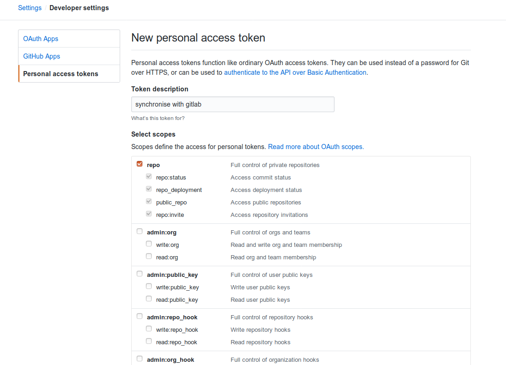
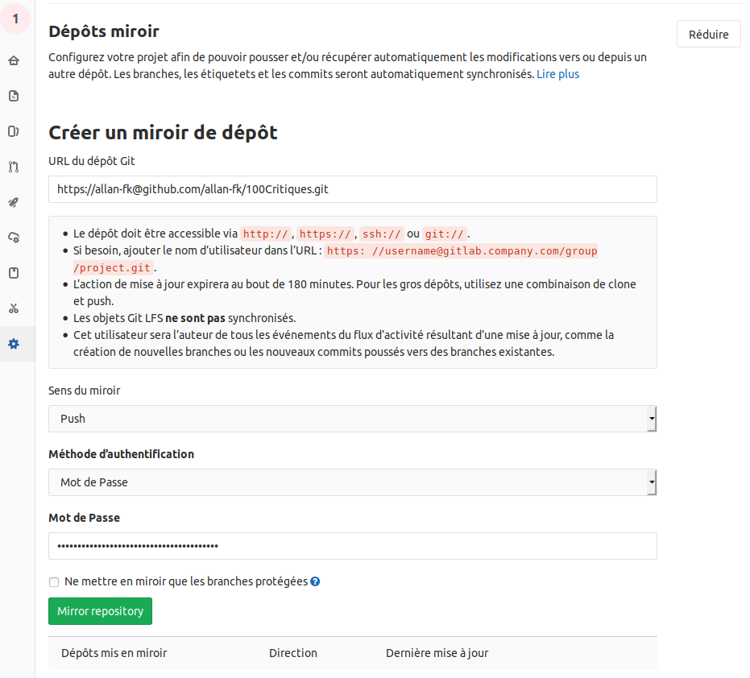

Git-hub tout les dév le savent, c'est cool. C'est un outil qui nous permet de sauvegarder et de partager nos codes avec le monde entier et d'accéder à ceux des autres instantanément, de faciliter sa veille grace à son systéme 'Trending repositories', de visualiser les diff entre les différents commits ainsi qu'un tas d'autres outils tailler spécialement pour NOUS les dév ~~parce que nous le vallons bien~~.

Mais derrieres toute cette ribambelle de features se cache différents problémes d'ordre éthiques en désaccord avec l'idée de ce que devraient être internet pour beaucoup. En effet, si à sa naissance internet avait était consus comme un moyen de partager l'information de façons désentraliser forcée de constater que depuis les années 2000 l'ére des petits sites perso bricoler en quelque semaines fit place à l'ére des gros mastodontes que sont les gafam et d'autres entités moins connus du grand public comme GitHub s'accaparent le monopole de la donnée en échange de solutions clés en mains pour les utilisateurs. Mais le but de ce post ne sera pas de lancer un einiéme débat sur la question de comment devrait être architecturer internet, non mais si vous voulez allez plus loin sur le sujet je ne peut que vous recommander la lecture du blog [carlchenet](https://carlchenet.com/le-danger-github/) qui en a fait un article spécifiquement en rapport avec le probléme GitHub.

Le but de ce post sera de répondre au probléme que peuvent rencontrer les utilisateurs d'autres service d'hébergement de code, souhaitant garder un lien avec GitHub grâce à GitLab.

#### GitLab c'est quoi ?

Git-lab pour ceux qui ne le s'auraient pas est un systéme de gestion de repo git exactement comme git-hub.
Pour ce faire créez-vous un compte Gitlab.

#### S'incronyser GitLab avec GitHub

1. Allez dans les paramétres de votre compte GitHub puis dans 'developper settings' générer vous un acces-token via la rubrique 'Personal access tokens'.

2. Pour la description vous pouvez mettre ce que vous voulez nous auront juste besoin de cochez la case repo pour passez à l'étape suivante, une fois ceci fait une nouvel clé sera générer que vous devrez conserver précieusement car elle ne sera plus accessible par la suite.


3. Une fois ceci-fait créer vous un nouveau repo sur gitlab dans le cas d'un projet déjà existant sur github importer le.

4. Allez dans les Paramétres/Dépôt de votre répo GitLab.

5. Puis dans Dépôts mirroir créer vous un mirroir de votre dépôt GitLab vers GitHub en y insérent dans le champs url

```
https://<YourGithubUsername>@github.com/<YourGithubUsername>/<RepoName>.git
```

et dans le champs Mot de Passe votre token générer précédement sur GitHub.



#### S'incronyser Gitlab avec vos dépôts git personnel