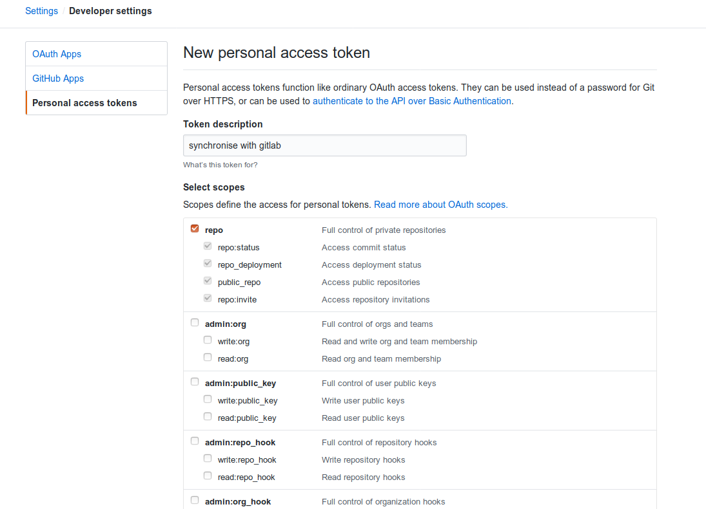
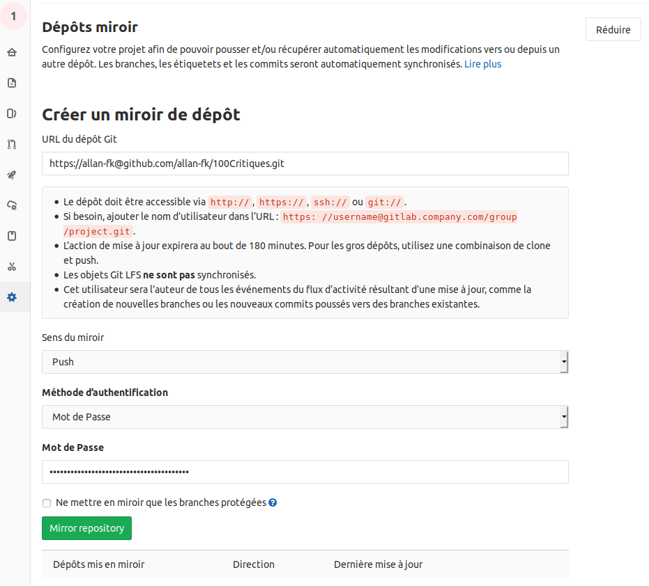

Git tout les développeurs le savent, est l'un des éléments les plus importants dans la réalisation d'un projet et encore plus aujourd'hui grâce à Github. Cette un outil qui nous permet de sauvegarder et de diffuser nos codes avec le monde entier et d'accéder à ceux des autres instantanément, de faciliter sa veille grace à son systéme de 'Trending repositories', de visualiser les différences entre les différentes version de nos codes ainsi qu'un tas d'autres outils tailler spécialement pour NOUS les développeurs sont autant de services dont on ne peux aujourd'hui se passer.

Mais derriere toute cette ribambelle de features qu'offre GitHub se cache différents problémes d'ordre éthiques en désaccord avec l'idée de ce que devraient être internet pour beaucoup. En effet, si à sa naissance internet avait était consus comme un moyen de partager l'information de façons désentraliser force est de constater que depuis la fin des années 2000 l'ére des petits sites perso bricoler en quelque semaines fit place à l'ére des gros mastodontes que sont les GAFAM et autres géants du web comme GitHub s'accaparent le monopole de la donnée en échange de solutions clés en mains pour les utilisateurs. 

Je vous rassure d'emblée le but de ce post ne sera pas de lancer un einiéme débat sur la question de "Comment devrait être architecturer internet ?", mais si vous voulez allez plus loin sur le sujet je ne peut que vous recommander la lecture du blog [carlchenet](https://carlchenet.com/le-danger-github/) qui a fait un excellent article sur les différents problémes que peuvent poser GitHub.

Le but de ce post sera de répondre aux problémes que peuvent rencontrer les utilisateurs d'autres services d'hébergement de code souhaitant s'émanciper de Github tout en gardant un pieds sur ce dernier.

#### GitLab c'est quoi ?

Git-lab est un site d'hébergement de codes exactement comme GitHub offrent tout autant de services mais avec le coté réseaux social en moins. Il a pour avantages notable d'avoire un tas de services utilisable gratuitement comme un systéme d'intégration continue ainsi que la possibilité de créer des répos privée. GitLab sous sa version gratuite est également open-source, ce qui en plus de garentir une sécurité quant à l'uitilisation de nos données, offre la possibilité de pouvoir modifier et héberger leurs services dans des infrastructures privée comme par exemple sur un raspberry que l'on utiliserait pour hébérger localement du codes-source, ou public comme c'est notament le cas pour FramaGit copie-conforme de Gitlab mais héberger par l'association Française Framasoft militant pour la protection de la vie privée sur internet ainsi que la démocratisation du logiciel libre.

### Pourquoi utiliser GitLab plutôt que Github ?

Si vous êtes débutant et que vous n'avez jamais hébergée vos codes sur des sites autres que GitHub il est toujours intéressant de jeter un coup d'oeil sur ce que fait la concurence. De plus si vous compter faire de la programmation votre métier vous serez forcément amenez un jour ou l'autre à utiliser GitLab, donc avoir un compte déjà créer et configurer sera toujours un plus.

### S'incronyser GitLab avec GitHub

Maintenant que les présentations sont faites et que vous avez eu le temps de faire 2/3 push, regardont comment synchroniser nos deux services.

1. Premiérement allez dans les paramétres de votre compte GitHub puis dans 'developper settings' générer vous un acces-token via la rubrique 'Personal access tokens'. Cette clé vous permettera détablire un pont entre GitHub et GitLab.

2. Pour la description vous pouvez mettre ce que vous voulez nous auront juste besoin de cochez la case repo pour passez à l'étape suivante, une fois ceci fait une nouvel clé sera générer que vous devrez conserver précieusement car elle ne sera plus accessible par la suite.


3. Une fois ceci-fait créer vous un nouveau repo sur gitlab dans le cas d'un projet déjà existant sur github importer le.

4. Allez dans les Paramétres/Dépôt de votre répo GitLab.

5. Puis dans Dépôts mirroir créer vous un mirroir de votre dépôt GitLab vers GitHub en y insérent dans le champs url

```
https://<YourGithubUsername>@github.com/<YourGithubUsername>/<RepoName>.git
```

et dans le champs Mot de Passe votre token générer précédement sur GitHub.



et voilà il n'y a plus qu'à valider, GitLab vous créera un clone de votre répo actuelle sur GitHub et s'occupera de mettre à jour les répos sur vos deux compte à chaque push.